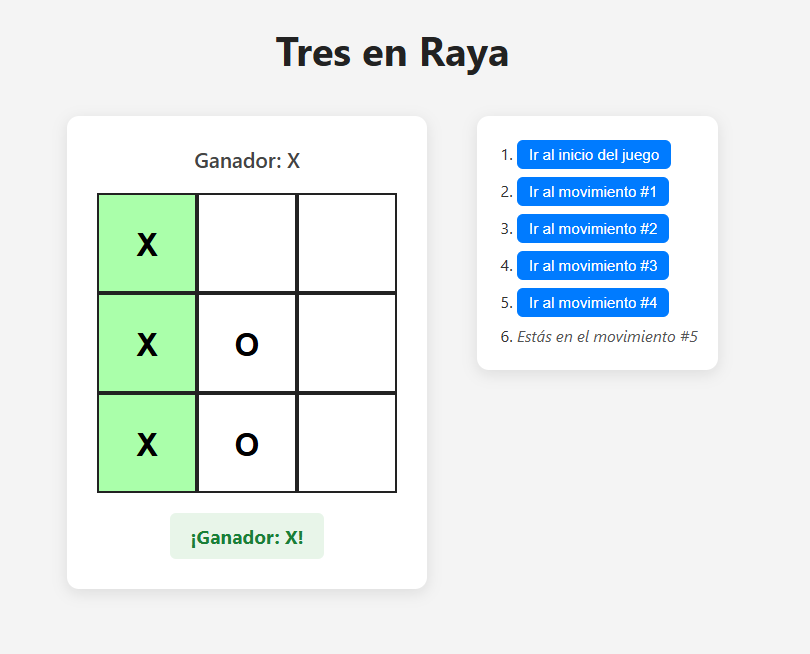

### Escuela Colombiana de Ingeniería
### Arquiecturas de Software

# Repositorio Frontend Parcial Practico ARSW

### GUIA

#### Para este repositorio nos guiamos del tutorial

> Aprenda a construir un Juego Tic Tac Toe siguiendo el tutorial que se indica aquí: https://reactjs.org/tutorial/tutorial.html#before-we-start-the-tutorial

### Funcionamiento

#### Instalacion

> npm install

> npm run dev 

Luego podremos ingresar al host donde estara corriendo el proyecto ( ej, http://localhost:5173/) y veremos lo siguiente:

Al ingresar veremos el juego ya funcionando.

***El juego puede acabar de tres formas, (Gana X, Gana O, Empate)***

#### Gana X

#### Gana O

#### Empate

**Al lado del tablero se encuentran los movimientos realizados durante la partida, al hacer click en estos se nos dirigira al momento de la partida en ese punto**